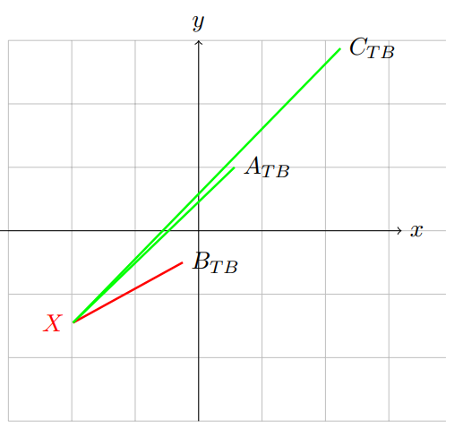
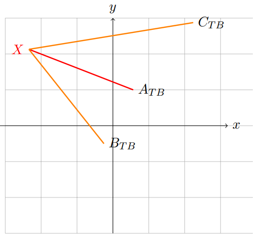

**Tran Minh Nhat (HCMUT)**

>**Problem** In the field of Artificial Intelligence, a method to classify a data point into a group of data
something is to use Euclidean distance. For example, in the figure, for 3 data sets with 3 mean points (greater than
represent all that data) is A, B, C, point X is closest to point A, so we can classify X into set A.


Write a C program that does the following:

- Initially: allows to enter points in set A, set B, set C from the keyboard. Calculate representative score by how to average the input values. For example, the user enters 3 points in the set A with coordinates respectively (3, 2), (-1, 1), (4, 3), the mean score representing set A is (2,2).

- Next, the user is allowed to enter any X coordinate value, using the distance method Euclid mentioned above, print the results of the classification of points X in which set. This operation repeats
continuously until the user presses the ESC key (ie, after printing out which set the point X belongs to, the computer will ask the user to enter another X point, until the user presses the ESC key, the chapter ends submit)

Demo: Enter set A with 3 points, set B with 2 points, set C with 2 points or more. Run with 3 X point cases different. Draw an illustration of the result


```c

#include <stdio.h>
#include <math.h>
#include <windows.h>
#include <conio.h>
//void NhapToaDoDiemA();
int main(){
    int n_a, n_b, n_c;
    char key;
    //Xu li A 
    printf("Nhap so diem cua A: ");
    scanf("%d",&n_a);
    float Hoanh_Do_A[n_a];
    float Tung_Do_A[n_a];
    float A_XTB, A_YTB, sumAx=0, sumAy=0;
    for(int i=0;i<n_a;i++){
        printf("Nhap toa do A[%d]: ",i);
        scanf("%f%f",&Hoanh_Do_A[i],&Tung_Do_A[i]);
    }
    for(int i=0;i<n_a;i++){
        sumAx+=Hoanh_Do_A[i];
        sumAy+=Tung_Do_A[i];
    }
    A_XTB=sumAx/(float)n_a;
    A_YTB=sumAy/(float)n_a;
    printf("Diem dai dien cho A: A_TB(%f,%f)\n",A_XTB, A_YTB);    
    
    //-------------------------------

    //Xu li B
    
    printf("Nhap so diem cua B: ");
    scanf("%d",&n_b);
    float Hoanh_Do_B[n_b];
    float Tung_Do_B[n_b];
    float B_XTB, B_YTB, sumBx=0, sumBy=0;
    for(int i=0;i<n_b;i++){
        printf("Nhap toa do B[%d]: ",i);
        scanf("%f%f",&Hoanh_Do_B[i],&Tung_Do_B[i]);
    }
    for(int i=0;i<n_b;i++){
        sumBx+=Hoanh_Do_B[i];
        sumBy+=Tung_Do_B[i];
    }
    B_XTB=sumBx/(float)n_b;
    B_YTB=sumBy/(float)n_b;
    printf("Diem dai dien cho B: B_TB(%f,%f)\n",B_XTB, B_YTB);
    
    //----------------------------------------

    //Xu li C
    
    printf("Nhap so diem cua C: ");
    scanf("%d",&n_c);
    float Hoanh_Do_C[n_c];
    float Tung_Do_C[n_c];
    float C_XTB, C_YTB, sumCx=0, sumCy=0;
    for(int i=0;i<n_c;i++){
        printf("Nhap toa do C[%d]: ",i);
        scanf("%f%f",&Hoanh_Do_C[i],&Tung_Do_C[i]);
    }
    for(int i=0;i<n_c;i++){
        sumCx+=Hoanh_Do_C[i];
        sumCy+=Tung_Do_C[i];
    }
    C_XTB=sumCx/(float)n_c;
    C_YTB=sumCy/(float)n_c;
    printf("Diem dai dien cho C: C_TB(%f,%f)\n",C_XTB, C_YTB);
    
    //----------------------------------

    //xu li X
    float XA, XB, XC, KC_min;
    float Hoanh_Do_X, Tung_Do_X;
    do{
        printf("Nhap toa do cua X: ");
        scanf("%f%f",&Hoanh_Do_X, &Tung_Do_X);
        XA=sqrt(pow((Hoanh_Do_X-A_XTB),2)+pow(Tung_Do_X-A_YTB,2));
        XB=sqrt(pow((Hoanh_Do_X-B_XTB),2)+pow(Tung_Do_X-B_YTB,2));
        XC=sqrt(pow((Hoanh_Do_X-C_XTB),2)+pow(Tung_Do_X-C_YTB,2));
        KC_min=XA<XB?(XA<XC?XA:XC):(XB<XC?XB:XC);
        if(KC_min==XA){
            printf("Phan loai X thuoc tap A\n");
        }else if(KC_min==XB){
            printf("Phan loai X thuoc tap B\n");
        }else{
            printf("Phan loai X thuoc tap C\n");
        }
        printf("Nhap ESC de thoat!\n");
        Sleep(2000);
        if(kbhit()){
            key=getch();
        }
    }while(key!=27);
}


```

***
**DEMO**
- A set: ```A0(1, 2) ; A1(−1.3, 3); A2(2, −2)```
- B set: ```B0(0, 0) ; B1(−0.5, −1)```
- C set: ```C0(2, 1) ; C1(3, 5); C2(2.5, 2.3); C3(1.45, 3.2)```


_**WHERE X: X(1,1)**_


_**WHERE X: X(−1.98, −1.45)**_



_**WHERE X: X(−2.34, 2.13)**_

